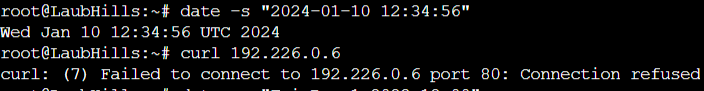

# Jarkom-Modul-5-F10-2023
Laporan resmi praktikum modul 5 firewall mata kuliah jaringan komputer

# Anggota
Kelompok: F10
Nama | NRP
--- | ---
Thoriq Afif Habibi | 5025211154
Radhiyan Muhammad Hisan | 5025211166

# Daftar Isi
- [Subnetting](#subnetting)
- [Konfigurasi Jaringan](#konfigurasi-jaringan)
- [Soal](#soal)

# Subnetting
<br>
<br>


# Konfigurasi Jaringan
1. Konfigurasi jaringan ada [di sini](NETCONF.md)
2. _Routing_ [di sini](routing.sh)
3. DHCP [di sini](dhcp.sh)
4. DHCP Relay [di sini](relay.sh)
5. Web Server [di sini](webServer.sh)
6. Client [di sini](client.sh)

# Soal
## 1. Agar topologi yang kalian buat dapat mengakses keluar, kalian diminta untuk mengkonfigurasi Aura menggunakan iptables, tetapi     tidak ingin menggunakan MASQUERADE.
Untuk menghubungkan topologi dengan jaringan di luar (internet) tanpa masquerade, digunakan script yang dijalankan di Aura sebagai berikut:
```shell
IPETH0="$(ip -br a | grep eth0 | awk '{print $NF}' | cut -d'/' -f1)"
iptables -t nat -A POSTROUTING -o eth0 -j SNAT --to-source "$IPETH0" -s 192.226.0.0/20
```
Penjelasan script tersebut adalah sebagai berikut:
- `ip -br a`: menampilkan informasi ip dan mac address secara singkat untuk tiap interface
- `grep eth0`: mengambil baris yang mengandung 'eth0' berdasarkan output `ip -br a` (output berformat 'eth0 UNKNOWN ipAddr/macAddr')
- `awk '{print $NF}'`: mengambil kolom terakhir dari baris (output berformat ipAddr/macAddr)
- `cut -d'/' -f1`: memotong string yang dipisahkan oleh delimiter '/' dan mengambil string pertama (ip address)
- `iptables -t nat -A POSTROUTING`: menambahkan aturan pada tabel NAT ke chain POSTROUTING.
- `-o eth0`: menentukan interface keluar sebagai eth0
- `-j SNAT`: menyatakan bahwa aturan berupa SNAT (Source Network Address Translation)
- `--to-source "$IPETH0"`: menentukan alamat ip sumber SNAT
- `-s 192.226.0.0/20`: menyatakan bahwa aturan hanya berlaku pada paket yang berasal dari alamat IP dalam rentang '192.226.0.0' hingga '192.226.15.255'

Untuk melakukan testing apakah topologi telah terhubung ke internet, saya mencoba melakukan ping google pada beberapa node, yaitu Revolte, LaubHills, TurkRegion, dan Sein sebagai berikut:


## 2. Drop semua TCP dan UDP kecuali port 8080 pada TCP
Untuk melakukan drop paket, kami menerapkan aturan drop pada chain INPUT, OUTPUT, dan FORWARD dan paket dengan protokol tcp maupun udp. Selanjutnya, kami menambahkan aturan accept untuk paket dengan protokol tcp dan port 8080. Script iptables dapat dilihat sebagai berikut:
```shell
iptables -A INPUT -p tcp --dport 8080 -j ACCEPT
iptables -A OUTPUT -p tcp --dport 8080 -j ACCEPT
iptables -A INPUT -p tcp -j DROP
iptables -A OUTPUT -p tcp -j DROP
iptables -A FORWARD -p tcp -j DROP
iptables -A INPUT -p udp -j DROP
iptables -A OUTPUT -p udp -j DROP
iptables -A FORWARD -p udp -j DROP

# testing : 
nc -lnvp 8080 # di node firewall berjalan
nc IP 8080 # terserah
```
Untuk melakukan testing, saya menggunakan netcat sebagai berikut:


## 3. Membatasi DHCP dan DNS Server hanya dapat dilakukan ping oleh maksimal 3 device secara bersamaan, selebihnya akan di drop
ping menggunakan protokol icmp sehingga dapat dibatasi dengan membuat aturan protokol icmp menggunakan connlimit. Paket akan didrop jika jumlah device yang melakukan ping lebih dari 3 dengan menjalankan script berikut di Revolte (DHCP) dan Richter (DNS)
```shell
iptables -A INPUT -p icmp -m connlimit --connlimit-above 3 --connlimit-mask 0 -j DROP

# Testing:
ping 192.226.0.18 # Revolte
ping 192.226.0.14 # Richter
```
Jika menggunakan `REJECT`, setelah ada percobaan ping dari node keempat, maka status ping di semua node akan menghasilkan **Destination host unreachable**. Sedangkan jika menggunakan `DROP`, proses ping di semua node akan beku/diam

Untuk melakukan testing, saya menggunakan 4 node yang akan melakukan ping ke revolte (192.226.0.18) sebagai berikut:

Pada gambar, terlihat client tidak menerima pesan response ping dari revolte. Hal ini dikarenakan paket ping yang dikirimkan node didrop oleh revolte<br>
Testing juga kami lakukan untuk Richter (192.226.0.18) sebagai berikut:


## 4. Pembatasan sehingga koneksi SSH pada Web Server hanya dapat dilakukan oleh masyarakat yang berada pada GrobeForest
SSH berjalan di port 22 dan protokol tcp, sehingga pembatasan koneksi dapat dilakukan dengan membuat aturan untuk port 22 dan protokol tcp. Aturan pertama akan menerima paket dari grobeforest dan aturan kedua melakukan reject pada paket selain dari grobeforest. Aturan ini diberlakukan pada web server dengan menjalankan script berikut: 
```shell
iptables -A INPUT -p tcp --dport 22 -s 192.226.4.0/22  -j ACCEPT
iptables -A INPUT -p tcp --dport 22 -j REJECT

# Testing:
ssh 192.226.4.2 # Sein
ssh 192.226.0.6 # Stark
```

Kami melakukan testing dengan mencoba mengakses ssh dari grobeforest dan Richter. Pada grobeforest, server menerima paket grobeforest sehingga muncul input password. Sedangkan pada Richter, paket tidak diterima sehingga tidak terjadi apapun (beku/diam/penolakan). Berikut testing yang kami lakukan:
- Sein<br>

- Stark<br>


## 5. Akses menuju WebServer hanya diperbolehkan saat jam kerja yaitu Senin-Jumat pada pukul 08.00-16.00
Pembatasan jam dapat dilakukan dengan membuat aturan ACCEPT pada waktu yang sesuai kemudian membuat aturan reject pada selainnya. Karena webserver berjalan di port 80 dan 443, maka dibuat aturan untuk masing-masing port. Implementasi aturan dapat dengan menjalankan script iptables berikut di Sein dan Stark:
```shell
iptables -A INPUT -p tcp --dport 80  -m state --state NEW -m time --timestart 08:00 --timestop 16:00 -m time --days Mon,Tue,Wed,Thu,Fri -j ACCEPT
iptables -A INPUT -p tcp --dport 80  -m state --state NEW -j REJECT
iptables -A INPUT -p tcp --dport 443  -m state --state NEW -m time --timestart 08:00 --timestop 16:00 -m time --days Mon,Tue,Wed,Thu,Fri -j ACCEPT
iptables -A INPUT -p tcp --dport 443  -m state --state NEW -j REJECT

# Testing :
date -s "Fri Dec 1 10:00"
curl 192.226.4.2 # Sein
curl 192.226.0.6 # Stark
```
Testing:
- Sein<br>

- Stark<br>


## 6. akses pada hari Senin - Kamis pada jam 12.00 - 13.00 dilarang (istirahat maksi cuy) dan akses di hari Jumat pada jam 11.00 - 13.00 juga dilarang (maklum, Jumatan rek)
Pada nomer 6, kita hanya perlu memberikan aturan tambahan untuk melakukan Reject. Pada iptables, aturan ini harus berada di atas aturan nomor 5 agar tidak tertutup sehingga kami meletakkan script berikut sebelum script nomor 5:
```shell
iptables -A INPUT -p tcp --dport 80 -m state --state NEW -m time --timestart 12:00 --timestop 13:00 -m time --days Mon,Tue,Wed,Thu -j REJECT
iptables -A INPUT -p tcp --dport 80 -m state --state NEW -m time --timestart 11:00 --timestop 13:00 -m time --days Fri -j REJECT
iptables -A INPUT -p tcp --dport 443 -m state --state NEW -m time --timestart 12:00 --timestop 13:00 -m time --days Mon,Tue,Wed,Thu -j REJECT
iptables -A INPUT -p tcp --dport 443 -m state --state NEW -m time --timestart 11:00 --timestop 13:00 -m time --days Fri -j REJECT

# Testing :
date -s "Fri Dec 1 12:00"
lynx 192.226.4.2 # Sein
lynx 192.226.0.6 # Stark
```
Testing:
- Sein<br>

- Stark<br>


## 7. setiap client yang mengakses Sein dengan Port 80 akan didistribusikan secara bergantian pada Sein dan Stark secara berurutan dan request dari client yang mengakses Stark dengan port 443 akan didistribusikan secara bergantian pada Sein dan Stark secara berurutan.
```shell
iptables -A PREROUTING -t nat -p tcp --dport 80 -d 192.226.4.2 -m statistic --mode nth --every 2 --packet 0 -j DNAT --to-destination 192.226.4.2
iptables -A PREROUTING -t nat -p tcp --dport 80 -d 192.226.4.2 -j DNAT --to-destination 192.226.0.6
iptables -A PREROUTING -t nat -p tcp --dport 443 -d 192.226.0.6 -m statistic --mode nth --every 2 --packet 0 -j DNAT --to-destination 192.226.0.6
iptables -A PREROUTING -t nat -p tcp --dport 443 -d 192.226.0.6 -j DNAT --to-destination 192.226.4.2

# Testing :
curl 192.226.4.2 # Sein
curl 192.226.0.6 # Stark
```

## 8. maka subnet dengan masyarakat yang berada pada Revolte dilarang keras mengakses WebServer hingga masa pencoblosan pemilu kepala suku 2024 berakhir.
Untuk melarang revolte mengakses webserver selama masa pemilu, perlu ditambahkan aturan iptables pada Sein dan Stark sebagai berikut:
```shell
iptables -A INPUT -p tcp --dport 80 -s 192.226.0.16/30 -m time --datestart 2023-12-15 --datestop 2024-02-15 -j REJECT

# Testing :
date -s "2024-01-10 12:34:56"
curl 192.226.4.2 # Sein
curl 192.226.0.6 # Stark
```

Testing:
- date -s "Fri Dec 1 2023 10:00"<br>

- date -s "2024-01-10 12:34:56"<br>


## 9. WebServer harus dapat secara otomatis memblokir  alamat IP yang melakukan scanning port dalam jumlah banyak (maksimal 20 scan port) di dalam selang waktu 10 menit
Memblokir alamat IP yang melakukan scanning port dapat dilakukan dengan menambahkan aturan iptables pada Sein dan Stark yang mengatur portscan menghitung jumlah port yang discan dalam 600 detik. IP yang melakukan scan port lebih dari 20 akan direject, selainnya akan diterima. Aturan tersebut dapat dibuat dengan menjalankan script berikut:
```shell
iptables -N portscan

iptables -A INPUT -m recent --name portscan --update --seconds 600 --hitcount 20 -j REJECT
iptables -A FORWARD -m recent --name portscan --update --seconds 600 --hitcount 20 -j REJECT

iptables -A INPUT -m recent --name portscan --set -j ACCEPT
iptables -A FORWARD -m recent --name portscan --set -j ACCEPT
```

Untuk melakukan testing, kami menggunakan nmap dengan 2 skenario, scanning 10 port dan 30 port. Pada scanning 10 port, didapatkan informasi port 1-10 dengan state `closed`. Sedangkan pada 30 port, semua berstatus filtered yang berarti paket diblokir oleh host yang discanning. Berikut hasil testing:
- 10 port<br>

- 30 port<br>

